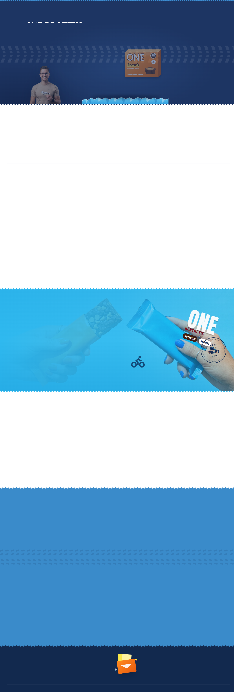

# One Protein 💪

A premium protein bar brand website built with React 19, Vite, Tailwind CSS v4, and Framer Motion. Features a sophisticated navy/blue/green/yellow color system, custom image cutout effects, zigzag section transitions, and a distinctive "ticket" button style.

## 🎨 Brand Identity

### Color Palette
| Color | Hex | Usage |
|-------|-----|-------|
| **Navy Deep** | `#12294e` | Primary text, headings |
| **Navy** | `#12315f` | Section headings |
| **Blue Primary** | `#3a8bca` | Reviews section background |
| **Blue Bright** | `#2fb9ef` | Banner background, accents |
| **Blue Mid** | `#3aa5ef` | Flavor card gradients |
| **Green Fresh** | `#9cc32a` | Flavor card (Chocolate Almond) |
| **Purple Muted** | `#9a8a90` | Flavor card (Glazed Doughnut) |
| **Orange Accent** | `#ff6a1a` | CTAs, price highlights |
| **Yellow Highlight** | `#f9e84a` | Buttons, borders, accents |
| **White** | `#ffffff` | Card backgrounds |
| **Cream** | `#fdf6ec` | Review card backgrounds |

### Logo / Wordmark
**OneLogo** component renders:
- "ONE" in bold condensed type
- "Protein" in display font (Syne)
- Distinctive yellow accent on "Protein"
- Used in Header, Hero, Banner, and Footer

### Typography
- **Display**: "Syne" (Google Fonts) — distinctive, wide letterforms
- **Condensed**: "Barlow Condensed" — tight, bold UI text
- **Body**: System UI fallback

### Visual Style
- **Cutout Images**: CSS `mix-blend-mode` + custom masking for foreground-only photos
- **ZigZag Dividers**: SVG clip-path section transitions between color backgrounds
- **Ticket Buttons**: Notched clip-path pill buttons with shadow wrap
- **Quality Stamp**: Decorative badge with checkmark
- **Burst Accents**: Starburst decorative elements
- **Tire Tracks**: Subtle background pattern

---

## ✨ Key Features

| Feature | Description |
|---------|-------------|
| **Custom Image Cutouts** | `Cutout` component with tolerance/softness masking for product & lifestyle photos |
| **ZigZag Transitions** | Animated SVG clip-path dividers between sections |
| **Flavor Cards** | 3-column rotating protein bars with hover lift & tilt |
| **Design Scale System** | `useDesignScale` hook for responsive fluid typography |
| **Custom Cursor** | Dot + ring with hover expansion states |
| **Preloader** | Curtain-reveal entrance animation |
| **Scroll Progress** | Top bar indicator |
| **Marquee** | Infinite scrolling brand text |
| **Toast Notifications** | Cart/add-to-cart feedback |
| **Newsletter Form** | Footer subscription with success state |
| **Responsive Grid** | Fluid layouts with CSS Grid |

---

## 📸 Hero Section (Live Deployment)


*Hero: "ONE Protein For Everyone" headline with ticket "Shop Now" CTA, right side rotating protein bar showcase (3 variants: Chocolate Almond, Birthday Cake, Glazed Doughnut), "18g Protein" badge, ZigZag divider*

---

## 🛠 Tech Stack

```
React 19.2.6          │  Framer Motion 14
Vite 7.3.2            │  Tailwind CSS 4.1.17
TypeScript 5.9.3      │  Lucide React 1.52
vite-plugin-singlefile│  clsx + tailwind-merge
```

---

## 🚀 Getting Started

```bash
# Install dependencies
npm install

# Development server
npm run dev

# Production build
npm run build

# Preview build
npm run preview
```

---

## 📁 Project Structure

```
one-protein/
├── public/
│   └── images/           # Product & lifestyle photography
├── src/
│   ├── components/
│   │   ├── hero/
│   │   │   └── art.tsx   # OneLogo, ProteinBar, BarVariant types
│   │   ├── ui.tsx        # ZigZag, TireTracks, QualityStamp, Burst
│   │   ├── Header.tsx
│   │   ├── Hero.tsx
│   │   ├── Cutout.tsx    # Image masking component
│   │   └── Footer.tsx
│   ├── hooks/
│   │   └── useMediaQuery.ts  # useDesignScale, useMediaQuery
│   ├── lib/
│   │   ├── scale.ts      # COLORS object, design tokens
│   │   └── cutout.ts     # Image masking utilities
│   ├── utils/
│   │   └── cn.ts
│   ├── App.tsx           # Main composition (631 lines)
│   ├── index.css         # Design system (338 lines)
│   └── main.tsx
├── index.html
├── package.json
├── tsconfig.json
└── vite.config.ts
```

---

## 🎯 Core Components

### `Cutout` Component (`src/components/Cutout.tsx`)
Advanced image masking with configurable tolerance:
```tsx
// Person cutout (tolerant)
const PERSON_CUT = { tolerance: 16, softness: 22, lumaWeight: 0.5, holeFraction: 0.003 };

// Product cutout (strict white background)
const WHITE_CUT = { tolerance: 10, softness: 26, lumaWeight: 1, holeFraction: 0 };
```

### `ZigZag` Component
SVG clip-path section divider:
```tsx
<ZigZag top="#12294e" bottom="#ffffff" />
<ZigZag top="#ffffff" bottom="#2fb9ef" />
```

### `ProteinBar` Variants
| Variant | Color Scheme |
|---------|--------------|
| `almond` | Brown/beige (Chocolate Almond) |
| `birthday` | Pink/white sprinkles (Birthday Cake) |
| `maple` | Golden/brown (Glazed Doughnut) |
| `reese` | Orange/brown (Peanut Butter) |

### Design Tokens (`src/lib/scale.ts`)
```ts
const COLORS = {
  heroNavy: '#12294e',
  heroBlue: '#2fb9ef',
  cardGreen: '#9cc32a',
  cardBlue: '#3aa5ef',
  cardPurple: '#9a8a90',
  accentOrange: '#ff6a1a',
  accentYellow: '#f9e84a',
  // ...
};
```

---

## 🌐 Deployed

**Vercel**: https://one-protein-lubirges-projects.vercel.app

**GitHub**: https://github.com/lubirge777-star/one-protein

---

## 📄 License

MIT License - Built as a design showcase for One Protein brand.